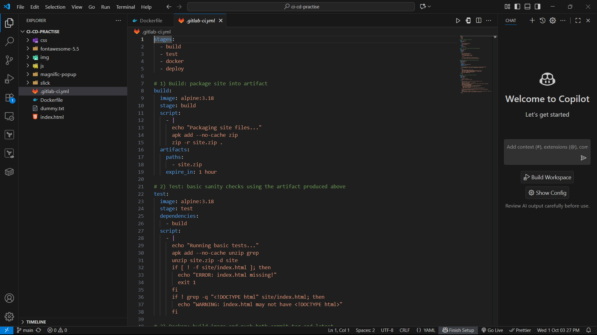
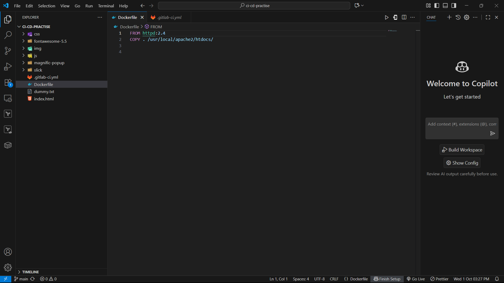
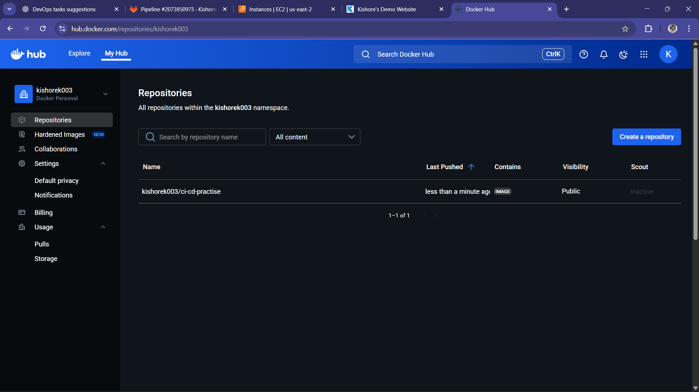
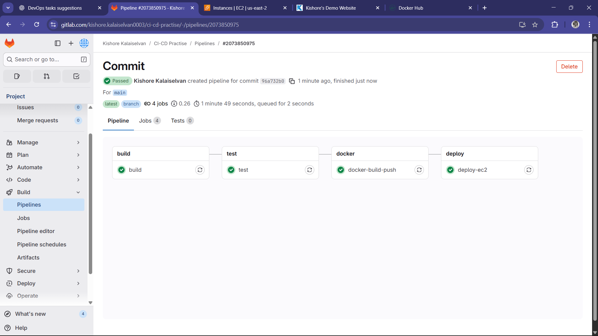
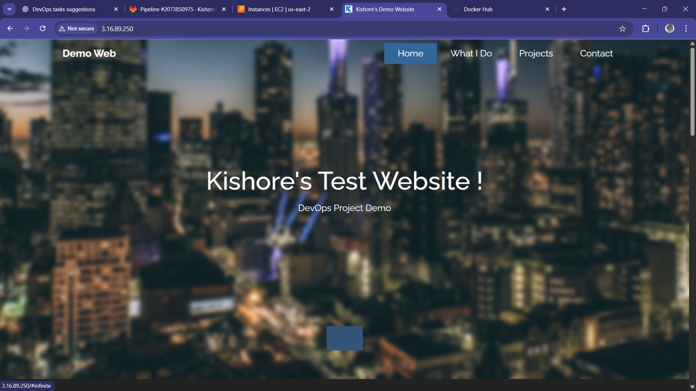

***Today I leant GitLab CI/CD, And I have created and deployed a complete pipeline for a static website (HTML, CSS, JS).The pipeline automates the build, test, containerization, image push, and deployment of the website.***

----------------------------------------------------------------------------------------------------------------------------------------------------------------------------------------------------------------------------------

**GitLab CI/CD Configuration:**
- Build → Package the site files (artifact for next stages).
- Test → Run basic checks (e.g., verify index.html exists).
- Dockerize → Build Docker image and push to Docker Hub.
- Deploy → SSH into EC2 instance, pull latest image, and run the container.

**GitLab CI/CD Basics**
- How to write and structure .gitlab-ci.yml.
- Understanding of pipeline stages, jobs, and artifacts.

**Build & Test Automation**
- Packaging source code artifacts in CI/CD.
- Running lightweight sanity tests (checking index.html, HTML syntax basics).
- Learned the importance of adding validation before deploying.

**Dockerization**
- Writing a simple Dockerfile for a static website.
- Building Docker images inside GitLab pipeline using docker:dind.
- Pushing images to DockerHub with proper tags (latest, commit SHA).

**CI/CD Secrets & Variables**
- How to securely store credentials in GitLab (e.g., DOCKER_USER, DOCKER_PASS, EC2_SSH_KEY).
- Importance of not hardcoding passwords/keys in pipeline files.

**Deployment to EC2**
- Setting up EC2 with Docker.
- Using GitLab to SSH into EC2 and run remote commands.
- Automating container restart (stop old container, pull new image, run latest).

----------------------------------------------------------------------------------------------------------------------------------------------------------------------------------------------------------------------------------
**Here are the Screenshots of the Project**
- 
  
- 
  
- 
  
- 
  
- 
