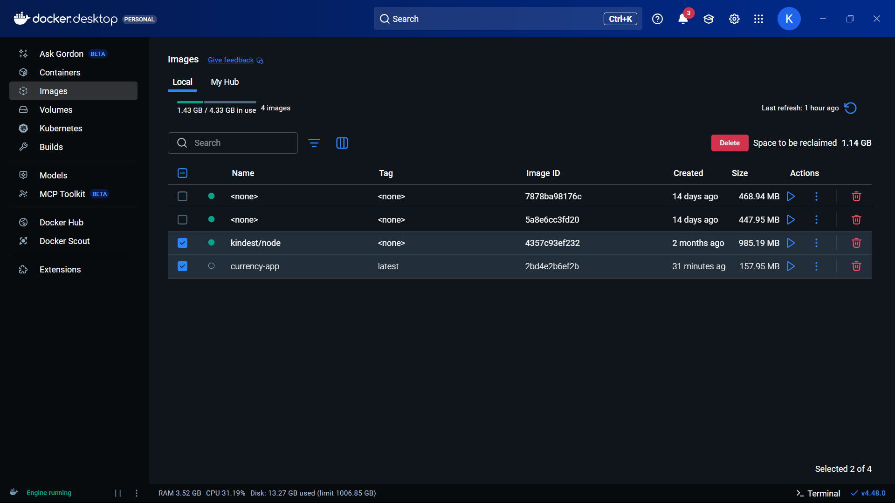
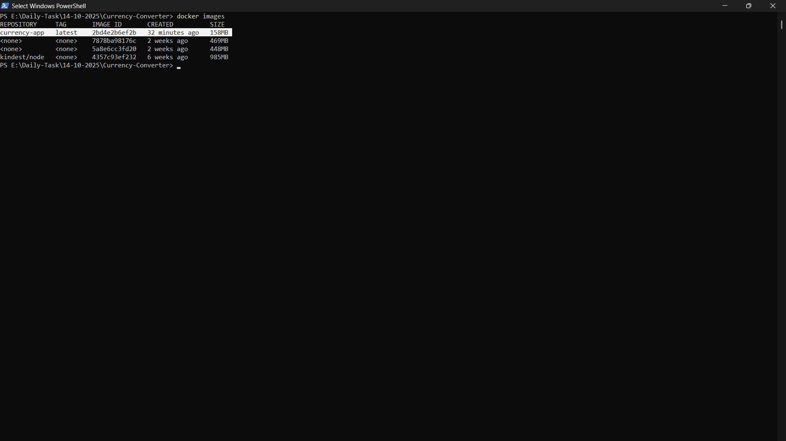
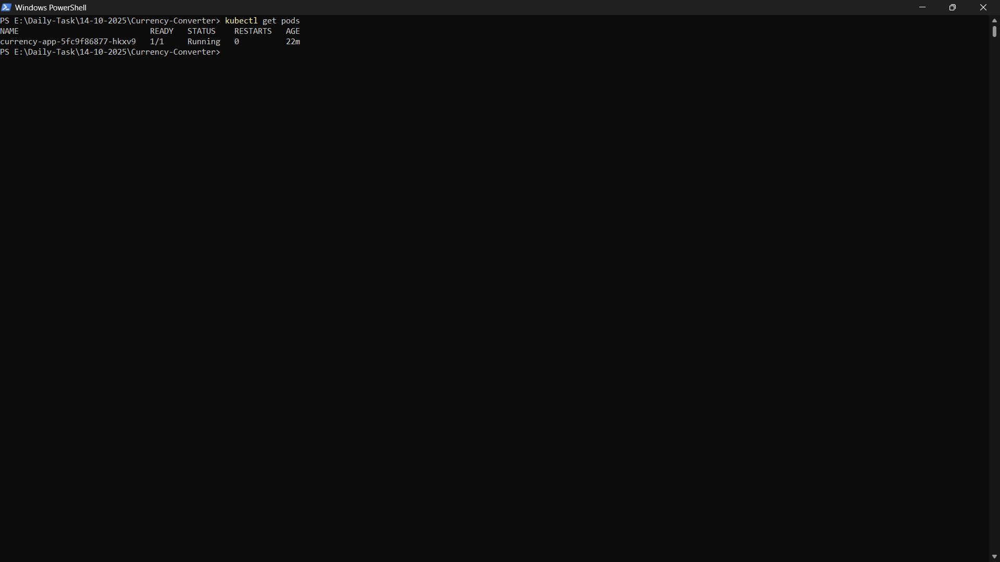
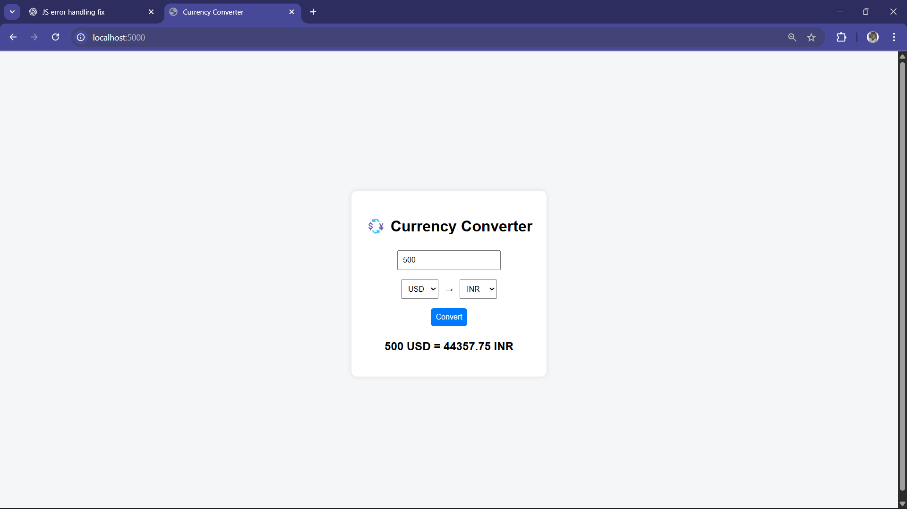

### Deploymoent of basic frontend + backend app on the kind cluster

#### Steps i done
- Installed Kind on the laptop
- Created the Kind cluster
- Containerize the web app using docker
- Loaded the docker image to the kind cluster (i have the docker image locally not in dockerhub)
- Deployed the container to the Kind Cluster
- accessed using the localhost

#### Screenshots for the reference
- Kind cluster running & App Also containerized (currency-app)
  - 
    
- Converted the docker file to docker container
  - 

- Loaded the image and the pods running
  - 

- Accessed using localhost
  - 
