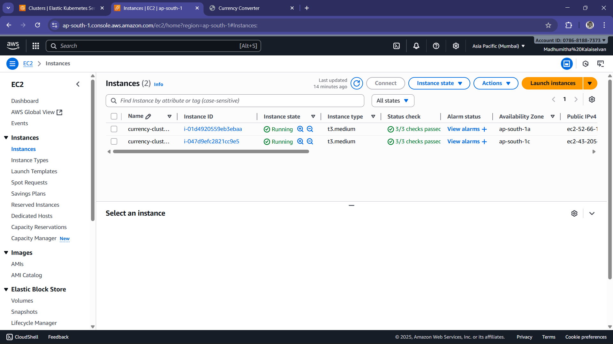

### Basic Web App Deployment on AWS EKS

### Steps I Followed

1. **Installed all prerequisites**
   - Installed AWS CLI, eksctl, and kubectl on my local machine.

2. **Created an EKS cluster**
   - Used eksctl to create a new EKS cluster named `currency-clusterr`.

3. **Connected kubectl to the cluster**
   - Updated my kubeconfig so that kubectl could communicate with the EKS cluster.

4. **Created Kubernetes deployment files**
   - Created a Deployment file for my Docker image `kishorek003/currency-app`.
   - Created a Service file to allow internal access to the application.
   - Created an Ingress file to expose the app to the external world.

5. **Deployed the application**
   - Applied the deployment, service, and ingress files using kubectl.
   - Confirmed that the pods were running inside the cluster.

6. **Installed NGINX Ingress Controller**
   - Installed the ingress controller so the application could be accessed externally.
    
7. **Tested the application**
   - Copied the LoadBalancer address from the ingress controller and opened the URL in a browser

### Here are the screenshots
- Here is my cluster created
  - 
- EKS Cluster created ec2 nodes as a worker nodes
  - 
- Screenshot of the output page
  - 
