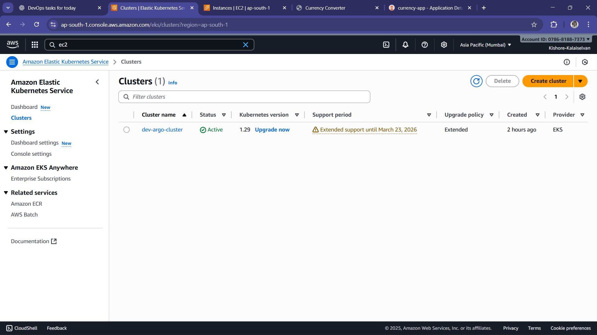
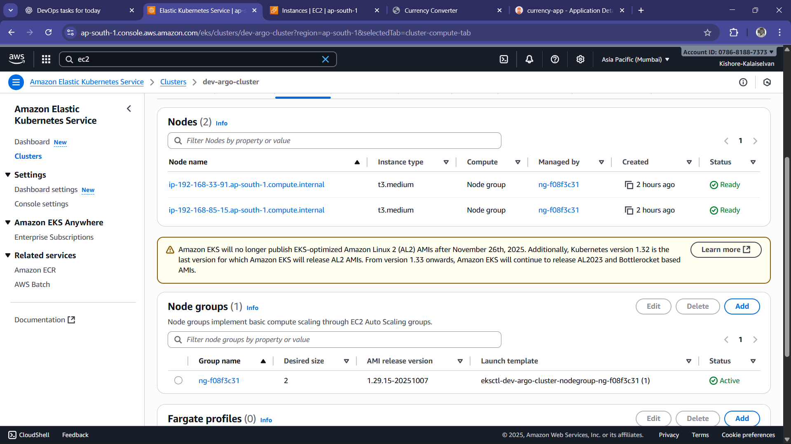
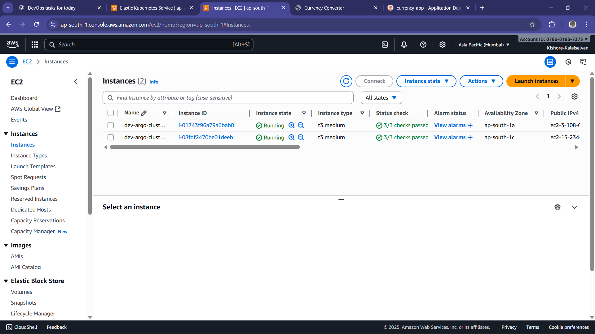
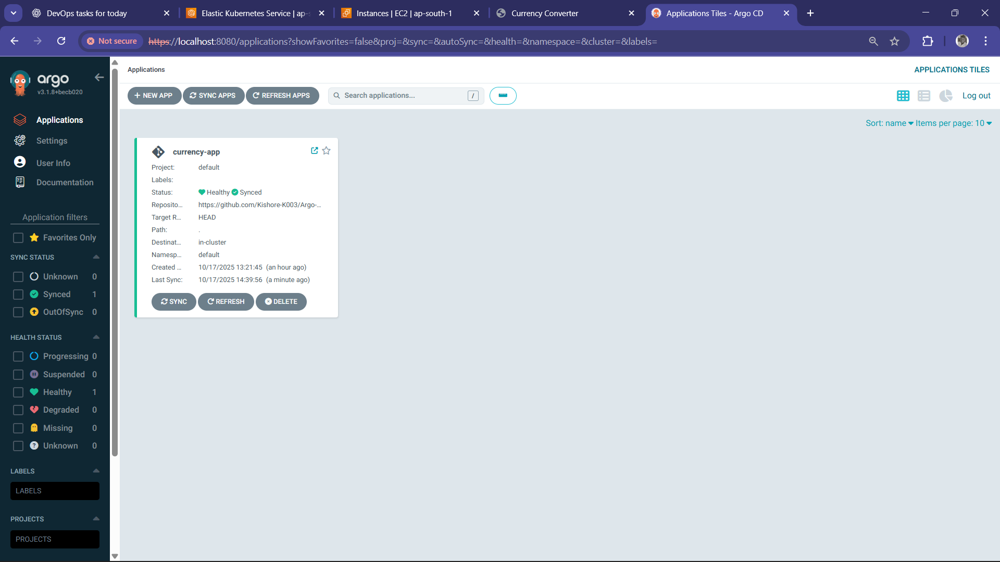
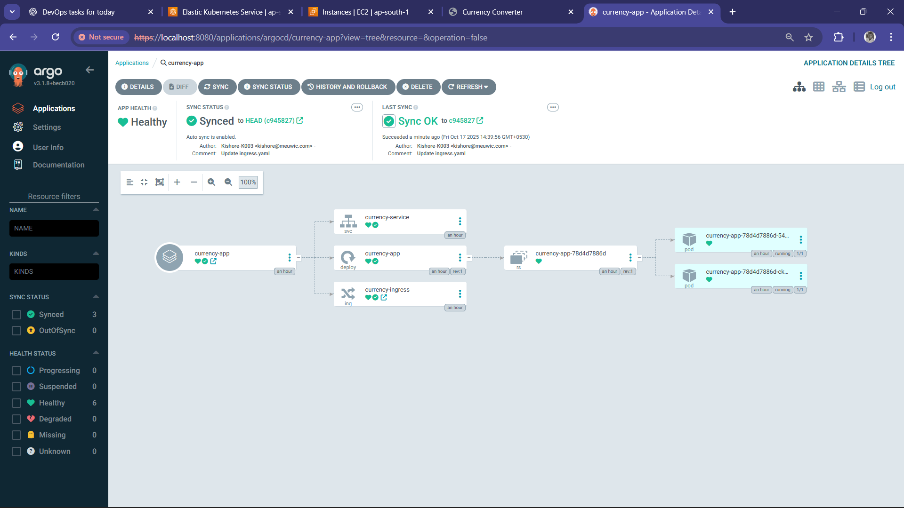
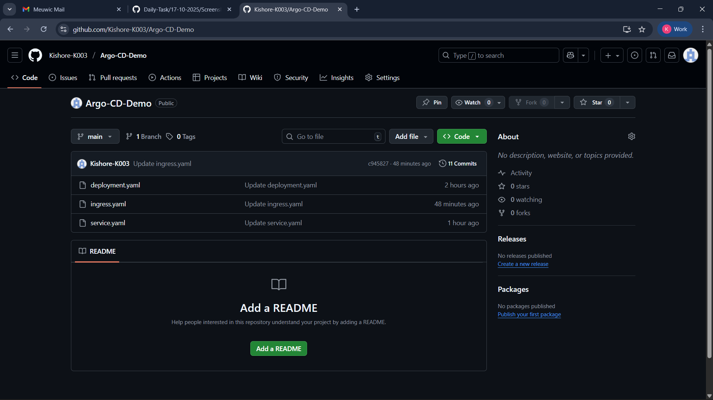
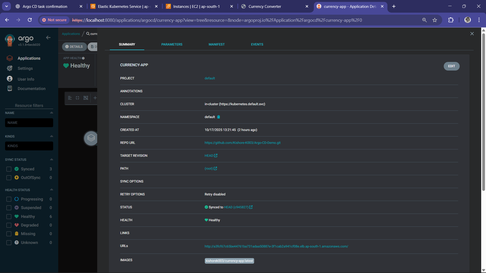
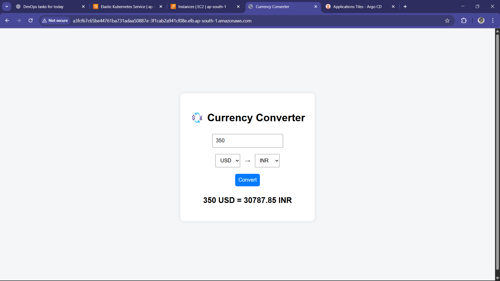

Today, I learned about Argo CD, a continuous delivery tool for Kubernetes that follows the GitOps model.
It enables automated deployment and synchronization of applications directly from a Git repository to a Kubernetes cluster.
Argo CD continuously monitors the state of applications and ensures that the live environment always matches the desired configuration stored in Git.
This helps maintain consistency, traceability, and easy rollback in deployments.

- ***Created an EKS Cluster***
  - Set up a new EKS cluster using eksctl with managed node groups to host applications.
    - 
    - 
    - 

- ***Installed Argo CD***
  - Installed Argo CD on the EKS cluster in a dedicated namespace and verified its components.

- ***Accessed Argo CD Dashboard***
  - Logged into the Argo CD UI using admin credentials and confirmed cluster connectivity.
    - 
    - 

- ***Prepared Git Repository***
  - Pushed all Kubernetes manifest files (Deployment, Service, Ingress.) to a GitHub repository.
    -  

- ***Linked GitHub Repo to Argo CD***
  - Connected the Git repository to Argo CD for automated application deployment.
    -  

- ***Automatic Deployment Verification***
  - Argo CD automatically deployed the application from the Git repo to the EKS cluster.
  - Here is the output.
    -  

