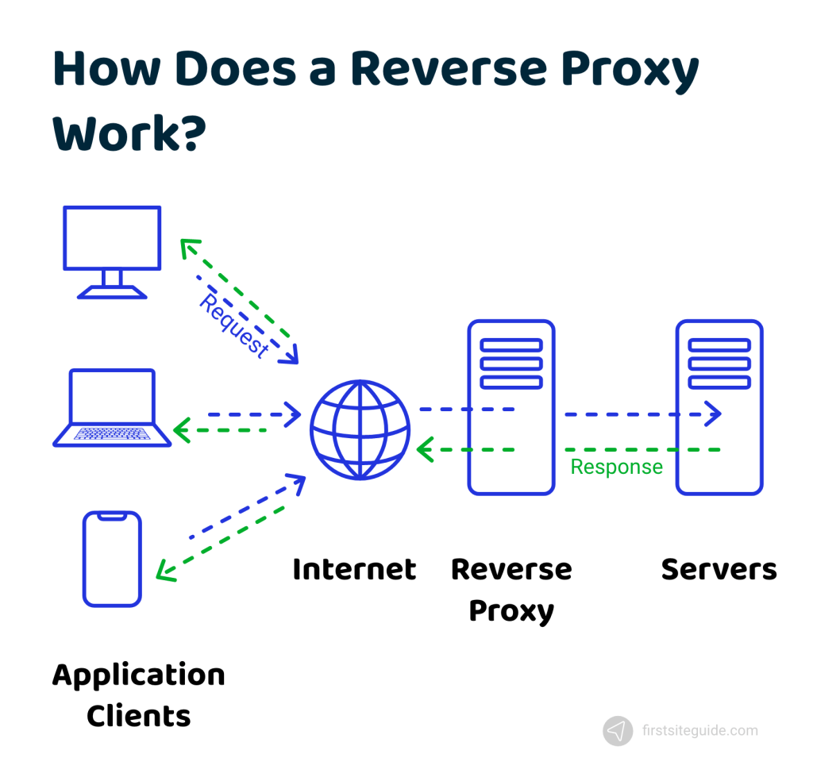
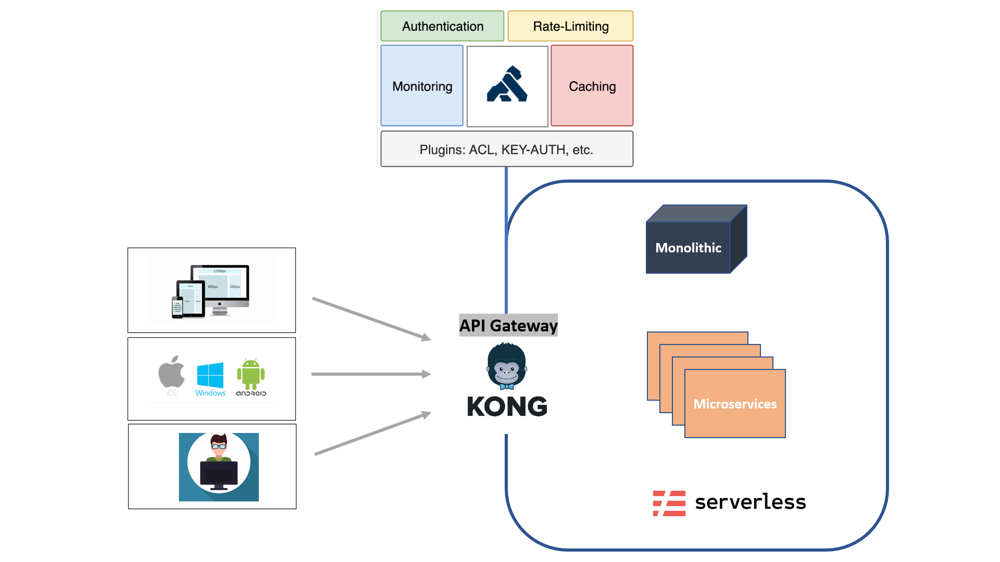

### Kong API Gateway 

- Kong API Gateway is an open-source API gateway that sits in front of your APIs. It acts as a reverse proxy, routing API requests to the appropriate backend services while also providing a centralized point for managing and securing your APIs.
- Reverse Proxy
  - A reverse proxy is a server that sits in front of one or more web servers, intercepting client requests before forwarding them to the appropriate backend server
  - 
- Kong provides a single entry point for all API traffic, enabling features like :
  - authentication
  - rate limiting
  - traffic management through a flexible plugin-based architecture.
- Its cloud-native and open-source nature makes it adaptable across various infrastructures, including hybrid and multi-cloud setups
- 

