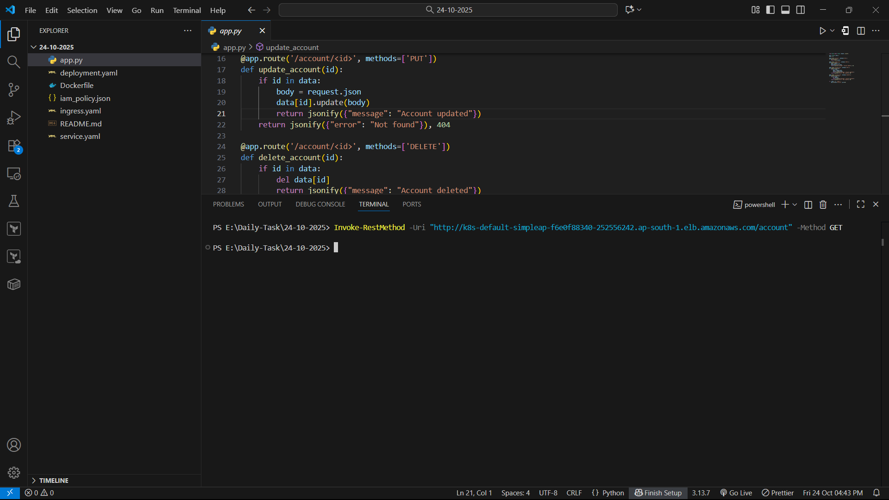
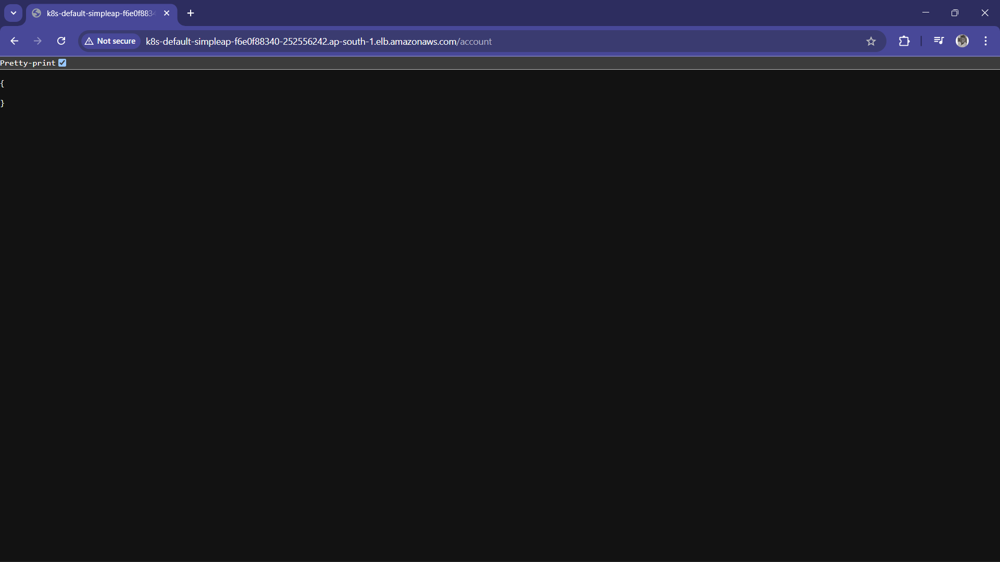
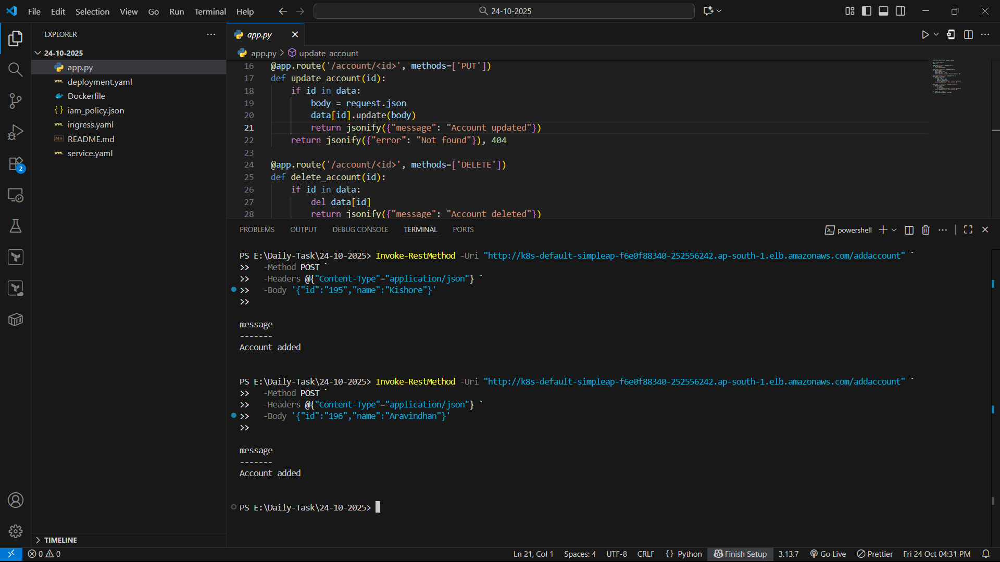
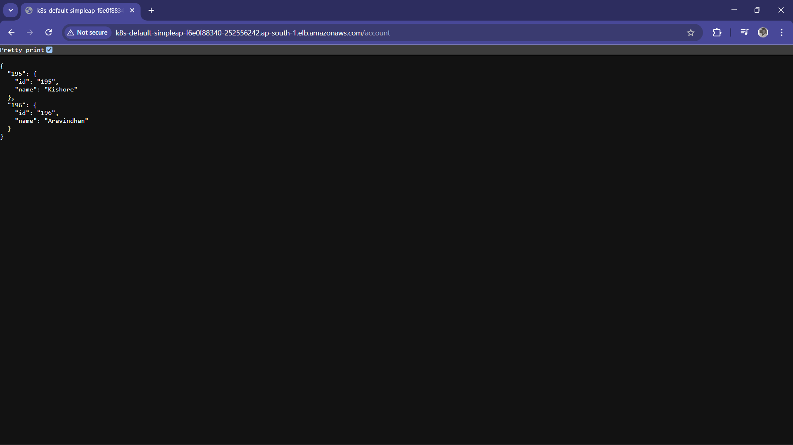
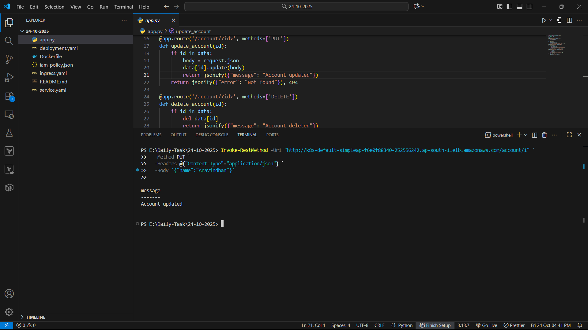
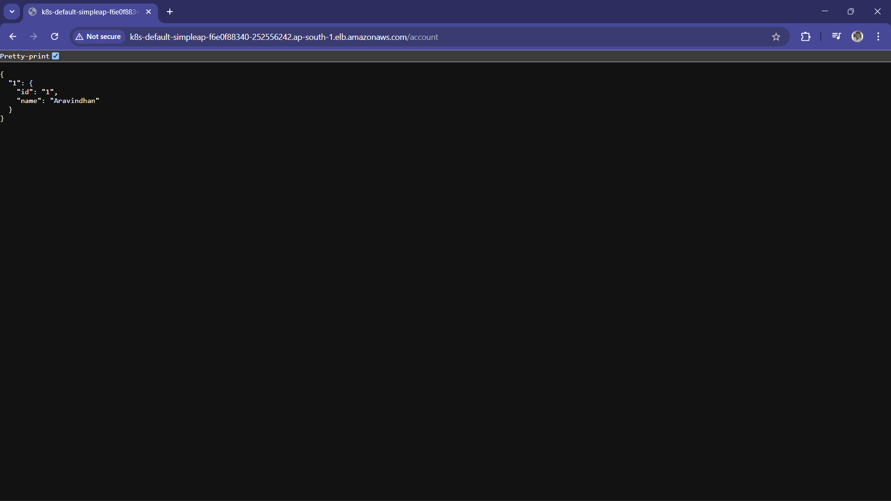
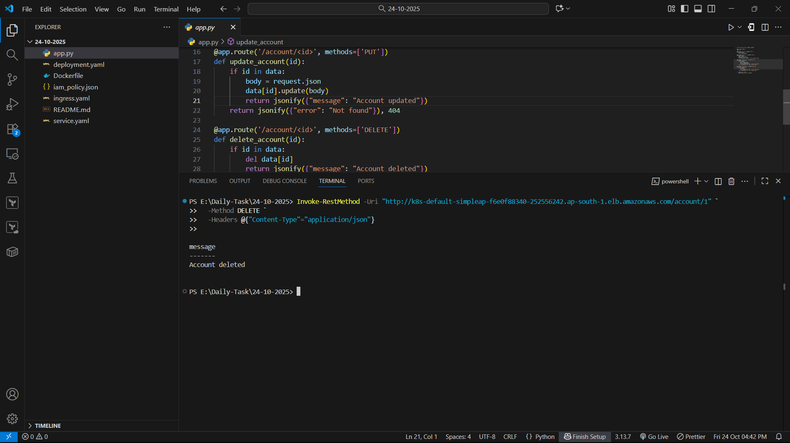

#### Deployed Simple API Service in EKS with ALB & API Gateway

- Created Flask API Service (Got Help From Google To Write Code)
  - Developed endpoints:
    - GET /account – fetch accounts
    - POST /addaccount – add new account
    - PUT /account/<id> – update account
    - DELETE /account/<id> – delete account
      
- Containerized the API
  - Built Docker image of the flask api service and pushed to Docker Hub.
    
- Deployed to Kubernetes (EKS)
  - Created Deployment and Service YAML files.
  - Exposed service using Service of type NodePort.

- Configured AWS ALB Ingress Controller
  - Installed ALB ingress controller in EKS.
  - Created Ingress.yaml resource to route traffic from ALB to the service.

- Configured AWS API Gateway
  - Created API Gateway HTTP API.
  - Integrated it with the ALB endpoint.
  - Mapped paths like:
    - http://k8s-default-simpleap-f6e0f88340-252556242.ap-south-1.elb.amazonaws.com/account
    - http://k8s-default-simpleap-f6e0f88340-252556242.ap-south-1.elb.amazonaws.com/addaccount

#### Screenshots
- GET METHOD
  - 
  - 
    
- POST METHOD
  - 
  - 

- PUT METHOD
  - 
  - 

- DELETE METHOD
  - 
  - 
