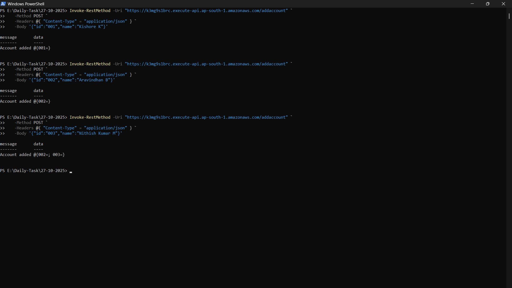
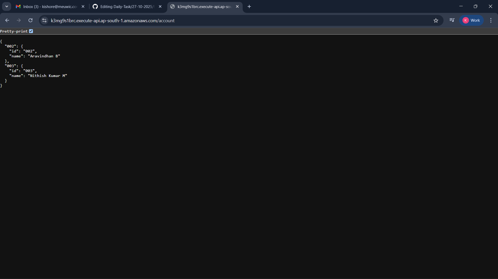
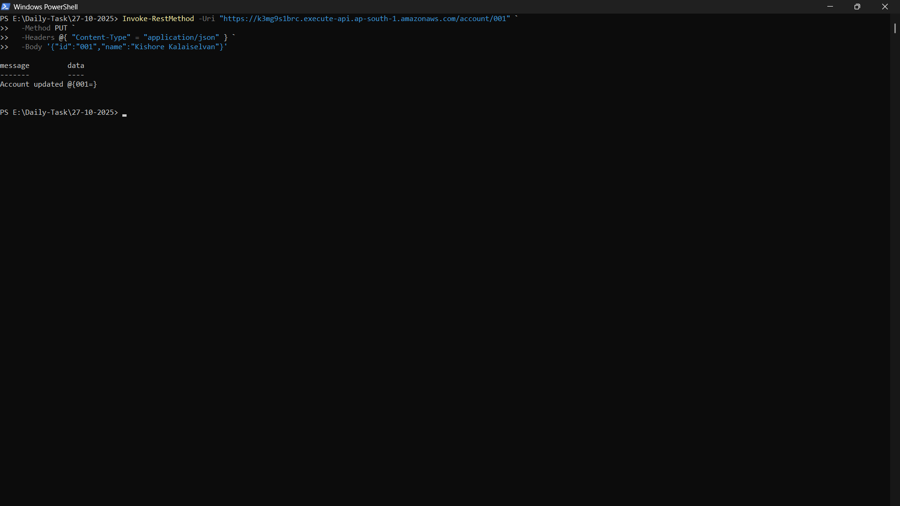
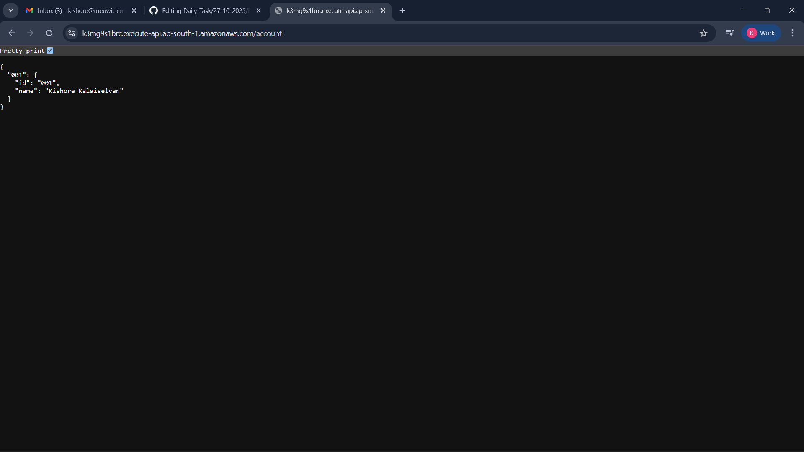
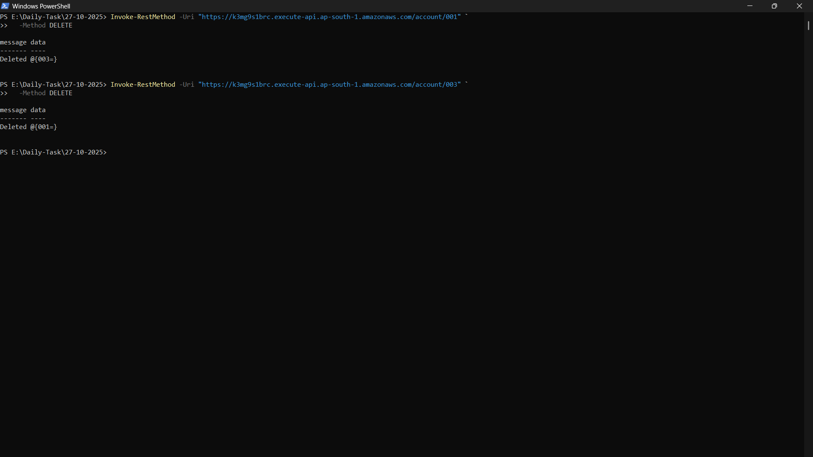
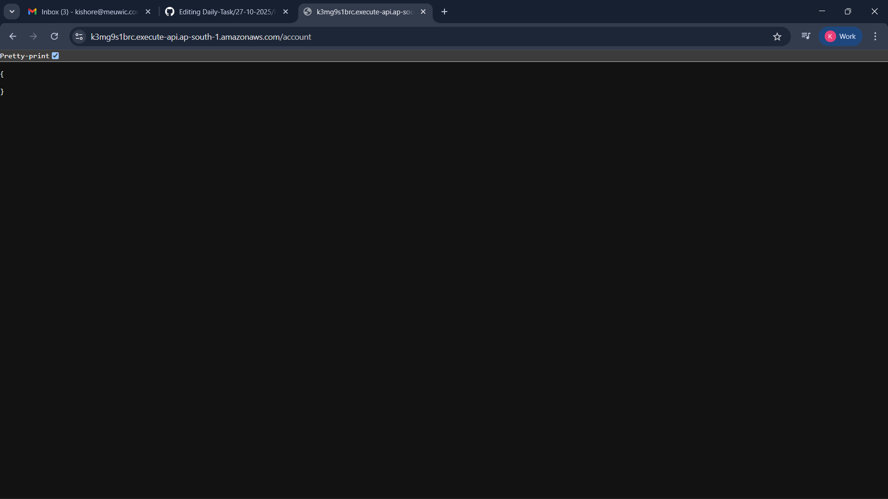

#### Deployed Simple API Service in EKS with ALB & API Gateway

##### Steps I Performed to implement this

- **Created Node (Express.js) API Service (Got Help From Google To Write Code)**
  - Developed endpoints:
    - GET /account – fetch accounts
    - POST /addaccount – add new account
    - PUT /account/<id> – update account
    - DELETE /account/<id> – delete account
  - Containerized this API service built Docker image and pushed to Docker Hub.
      
- **Created a EKS cluster**
  -  `eksctl create cluster \
  --name simple-api-cluster \
  --region ap-south-1 \
  --nodegroup-name standard-nodes \
  --node-type t3.medium \
  --nodes 2 \
  --nodes-min 1 \
  --nodes-max 3 \
  --managed`

- **Created a IAM OIDC provider**
  - `eksctl utils associate-iam-oidc-provider \
  --region ap-south-1 \
  --cluster simple-api-cluster \
  --approve`
    
- **Create IAM policy for AWS Load Balancer Controller**
  - `curl -o iam-policy.json \
https://raw.githubusercontent.com/kubernetes-sigs/aws-load-balancer-controller/main/docs/install/iam_policy.json `
  - `aws iam create-policy \
  --policy-name AWSLoadBalancerControllerIAMPolicy \
  --policy-document file://iam-policy.json`
    
- **Create service account for ALB Controller**
  - `eksctl create iamserviceaccount \
  --cluster=simple-api-cluster \
  --namespace=kube-system \
  --name=aws-load-balancer-controller \
  --attach-policy-arn=arn:aws:iam::<ACCOUNT_ID>:policy/AWSLoadBalancerControllerIAMPolicy \
  --approve`
    
- **Install AWS Load Balancer Controller using Helm**
  - `helm repo add eks https://aws.github.io/eks-charts`
  - `helm repo update`
  - `helm install aws-load-balancer-controller eks/aws-load-balancer-controller \
  -n kube-system \
  --set clusterName=simple-api-cluster \
  --set serviceAccount.create=false \
  --set serviceAccount.name=aws-load-balancer-controller`
    
- **Applied The Yaml Manifests (Deployment, Service, Ingress)**
  - `kubectl apply -f deployment.yaml`
  - `kubectl apply -f service.yaml`
  - `kubectl apply -f ingress.yaml` 
- **Created a API Gateway , integrated with the alb url & created a route**
  - https://k3mg9s1brc.execute-api.ap-south-1.amazonaws.com/account -> GET METHOD
  - https://k3mg9s1brc.execute-api.ap-south-1.amazonaws.com/addaccount -> POST METHOD
  - https://k3mg9s1brc.execute-api.ap-south-1.amazonaws.com/account{id} -> PUT METHOD
  - https://k3mg9s1brc.execute-api.ap-south-1.amazonaws.com/account{id} -> DELETE METHOD
    
- `FLOW : API GATEWAY -> ALB -> EKS -> POD`

##### Screenshots 
- **POST METHOD**
  - 
  - 
  
- **PUT METHOD**
  - 
  - 

- **DELETE METHOD**
  - 
  - 

      
